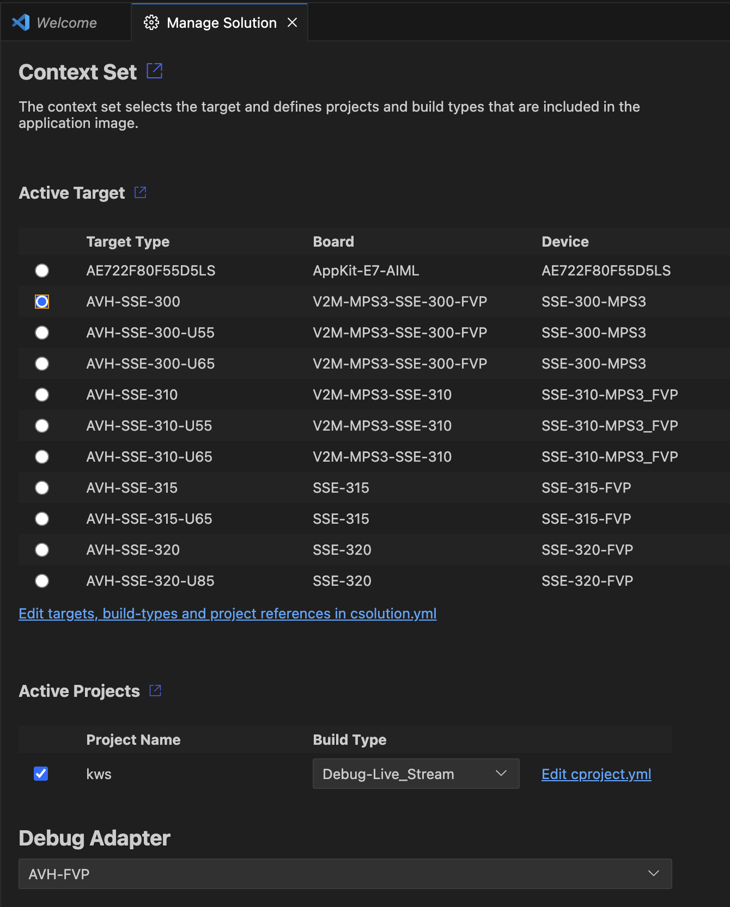

# Target Configuration Arm Virtual Hardware

<!-- markdownlint-disable MD013 -->
<!-- markdownlint-disable MD036 -->

## Supported Platforms

The MLEK templates support multiple virtual Arm Cortex-M platforms with Ethos-U NPU acceleration:

| Platform | Processor | NPU Options | Reference Application Support |
|----------|-----------|-------------|------------------|
| **Corstone-300** | Cortex-M55 | Ethos-U55, Ethos-U65, No NPU | All  |
| **Corstone-310** | Cortex-M85 | Ethos-U55, Ethos-U65, No NPU | All  |
| **Corstone-315** | Cortex-M85 | Ethos-U65 | All  |
| **Corstone-320** | Cortex-M85 | Ethos-U85 | All  |

These targets are preconfigured in the solution and allow to run the applications without hardware.

### Using VS Code

Open the **Manage Solution** dialog from the CMSIS Solution Extension window (see [user guide](https://marketplace.visualstudio.com/items?itemName=Arm.cmsis-csolution#manage-solution-view) for details).

You can select an arbitrary FVP platform. Refer to the the above table, to find out which Cortex-M CPU core and which Ethos-U NPU will be simulated. 

Select the Build Types *-Data_Array to create an application image that includes test data for the model. 

A run configuration will automatically be created, so you can start the model and the application in the internal VSCode terminal, with the Run feature. 

