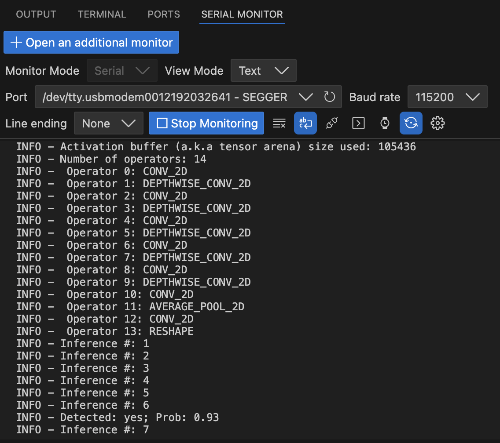

# MLEK Reference Applications - Audio

<!-- markdownlint-disable MD013 -->
<!-- markdownlint-disable MD036 -->

## Audio Processing Reference Applications

These reference applications focus on real-time audio processing:

- **Keyword Spotting (KWS)**: Demonstrates wake word detection and voice command recognition
- **Audio User Algorithm Template**: Provides a foundation for custom audio ML processing applications

## Required API Interfaces

For hardware deployment, the Board-Layer should provide the following API interfaces:

| Required API Interface | Description |
|:----------------------|:------------|
| **CMSIS_VIO** | Virtual I/O interface for LEDs, buttons, and basic I/O |
| **CMSIS_VSTREAM_AUDIO_IN** | Virtual Audio Input / Audio Interface |
| **STDOUT, STDERR** | Standard output for printf debugging and logging |

These interfaces ideally are supplied by the vendor of your evaluation board. For custom hardware, details on the implementation are 
found in the [CMSIS-Driver Manual](https://arm-software.github.io/CMSIS_6/latest/Driver/group__vstream__interface__gr.html)

## Keyword Spotting Application

Keyword spotting (KWS) is the process of detecting predefined words or phrases from a continuous audio stream. In the CMSIS-MLEK templates this allows an embedded device to listen for a "wake word" before executing further commands. The audio template provides an end-to-end implementation using TensorFlow Lite Micro and CMSIS-NN for optimized inference on Cortex-M processors.

### How KWS Works
- Incoming audio is captured from a microphone or played back from a test sample.
- The audio stream is converted into Mel-frequency cepstral coefficients (MFCC) features.
- A neural network classifies the MFCC features to determine which keyword, if any, was spoken.
- Detection results are reported via UART or LED indicators.

The template can detect up to twelve keywords. A sample audio file containing the word "down" is provided for testing.

*This capture shows serial output from a hardware target, while the application detects the keyword "yes" on a microphone stream.*

### Build Types
The KWS example defines four build types that control debug information and the audio source:

| Build Type | Description |
|------------|-------------|
| **Debug-Live_Stream** | Uses live microphone input with debug information enabled. |
| **Release-Live_Stream** | Live microphone input with optimizations for performance. |
| **Debug-Data_Array** | Processes a built-in audio array for regression testing with debug information. |
| **Release-Data_Array** | Processes the audio array with release optimizations. |

Use the Debug build types during development and the Release build types for performance measurements. Switch between *Live_Stream* and *Data_Array* depending on whether you want real-time audio or a fixed sample. On Arm Virtual Hardware Targets, the Live_Stream is utilizing the VSI interface 

## Audio User Algorithm Template

Todo.

## Working with MLEK Templates

See Target Configuration chapters on how to deploy the reference applications to a specific hardware or simulation target. 

